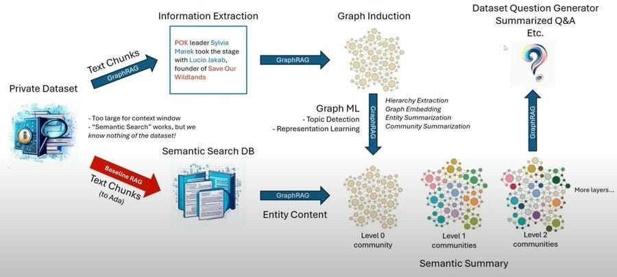

# Hiring Challenge: Construction d'un Agent Conversationnel Spécialisé



Ce dépôt GitHub contient le challenge organisé par **data354** pour évaluer vos compétences en développement d'agents conversationnels spécialisés.

## Table des Matières

- [À propos de data354](#à-propos-de-data354)
- [Présentation du Challenge](#présentation-du-challenge)
- [Recapitulatif du Challenge](#recapitulatif-du-challenge)

- [Structure du Repository](#structure-du-repository)
- [Comment Démarrer](#comment-démarrer)

- [Ressources](#ressources)

## À propos de data354

data354 est spécialisé dans les services liés à la donnée, offrant des solutions de stratégie, architecture, data engineering, et data science. Nous accompagnons nos clients dans la valorisation de leurs données à travers nos centres de ressources à Abidjan et Paris.

## Présentation du Challenge

OpenAI a révolutionné l'IA avec des agents conversationnels basés sur les Large Language Models (LLM). Toutefois, ces modèles ont des limites en termes de données privées et spécifiques. Pour y remédier, nous proposons d'explorer la **Génération Augmentée par Graphe de Connaissances (GraphRAG)**. Le but est de créer un agent conversationnel capable de répondre aux questions basées sur des documents OHADA.

### Votre Tâche

- **Pré-traiter les données** : Nettoyage et préparation des documents.
- **Créer une chaîne GraphRAG** : Intégration de graphes de connaissances.
- **Développer une interface web** : Pour interagir avec l'agent.

**Documents OHADA à utiliser**

- [Acte uniforme sur les contrats de transport de marchandises](https://www.ohada.com/telechargement/actes-uniformes/AUCTMR-2003_fr.pdf)

- [Acte uniforme sur le droit de l'arbitrage](https://www.ohada.com/telechargement/actes-uniformes/AUA-1999_fr.pdf).

## Recapitulatif du Challenge
Dans cette video je partage mon retour d'experience concernant le Challenge.
[](https://www.youtube.com/watch?v=HSBM2pFCLBI "Recap du Challenge en Video")


## Structure du Repository

```plaintext
.
├── .env.sample // Rename to `.env` and add your credentials # .
├── Readme.md
├── app.py
├── assets
│   └── images
│       ├── Screenshot_exceeded_quota.jpg
│       └── Screenshot_initial_interface.png
├── code
│   ├── __init__.py
│   ├── assets
│   │   └── images
│   │       ├── assistant-avatar.png
│   │       └── user-avatar.png
│   ├── config.py
│   ├── preprocessing.py
│   └── utils.py
├── notebooks
└── requirements.txt

```

## Comment Démarrer

Pour lancer l'app, executez les commandes suivantes.

**Prérequis**: 
- Python: Avoir Python 3.10+ installé(testé avec Python 3.11).
- OpenAI: Avoir une clé API valide à enseigner dans le fichier `.env`. Suivez l'ex de `'.env.sample`.


1. Cloner le dépôt:

```sh
git clone https://github.com/eaedk/data354-GraphRAG-demo.git
cd data354-GraphRAG-demo
```

2. Installer les dépendances:
Vous pouvez le faire directement ou créer un environnement virtuel.

```sh
pip install -r requirements.txt

```

3. Lancer l'application:

```sh
streamlit run app.py

```
Si tout a marché comme prévu, voici la sortie que vous devriez avoir.

```plaintext
  You can now view your Streamlit app in your browser.

  Local URL: http://localhost:8510
  Network URL: http://XXX.XXX.XXX.XXX:8510
```

Puis vous devriez avoir l'interface ci-dessous dans votre navigateur.


Vous pouvez maintenant poser des questions. 

## Ressources

Voulez-vous explorer les RAGs en général ou particulièrement les GraphRAGs, voilà des ressources pour commencer.

- [LangChain Documentation](https://python.langchain.com/docs/get-started/introduction)
- [LangGraph Documentation](https://langchain-ai.github.io/langgraph/)
- [Chainlit Documentation](https://docs.chainlit.io/get-started/overview)
- [LlamaIndex Documentation](https://docs.llamaindex.ai/en/stable/)
